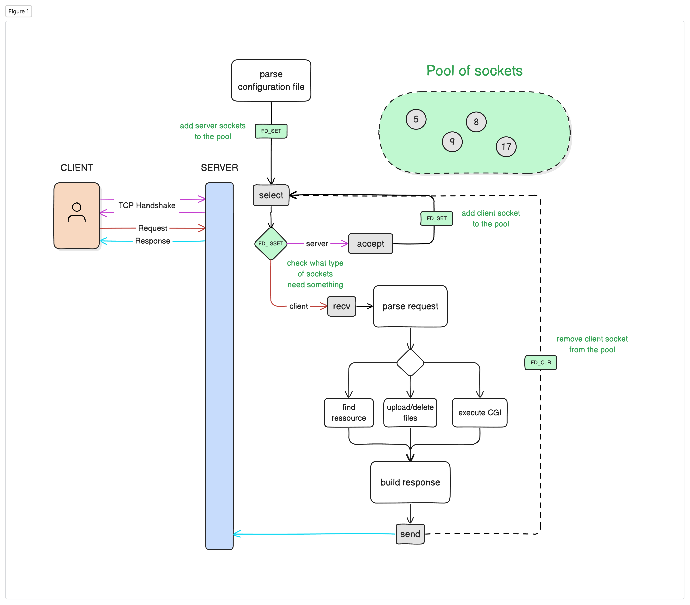

# ADARS
## Building an HTTP server using C++98 without libraries
This project was about building an HTTP in order to understand how they work under the hood. That's why no libraries were used (outside the standard ones).

</img>

## Features
- serve static pages (HTML, CSS,..)
- handles GET, POST and DELETE requests
- file upload
- handle multiple simultaneous connections
- run multiple servers on different ports based on config file
- have different settings for each server via a configuration file

## Try it
The easiest way is to run the docker image of our server. Here is how:
1. install and launch [Docker](https://www.docker.com/)
2. run the command `docker run rurangiza/adars` in your terminal
3. visit http://localhost:8000/ and have fun!

## How it works
</img>